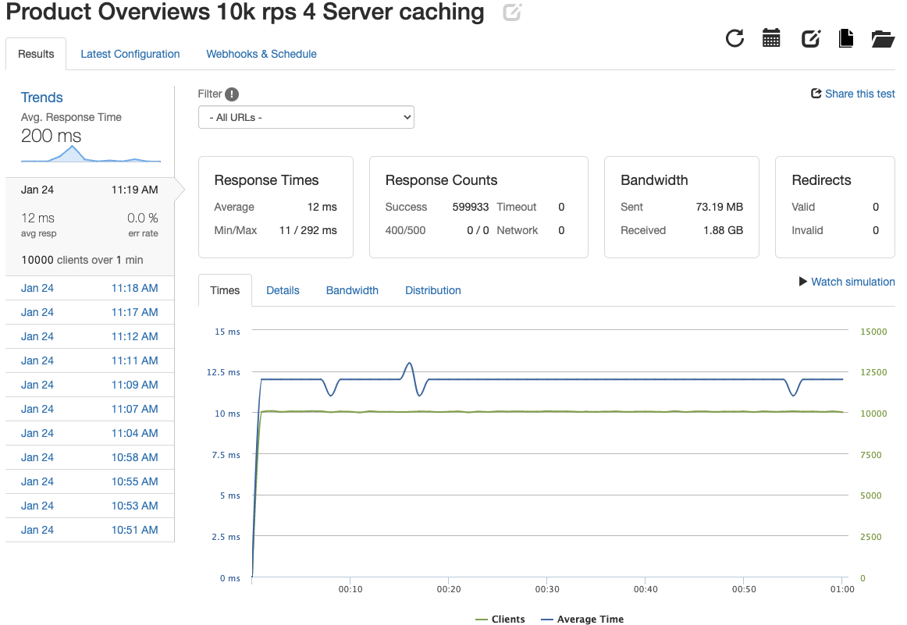

# OverviewAPI

##  Project Overview
  - Take existing back-end infrastructure and convert to a microservice architecture.
  - Handle over 1k request per second for all crud operations.

## Setup
  - 4 servers running on AWS Micro Ec2 instances.
  - 1 instance running NGINX with least connection load balancing, cacheing enabled.
  - 1 instance hosting PostgreSQL database.

## Testing Used
   - K6 for local testing of queries.
   - New Relic + Loader.io to test infrastructure under load.

## Results

